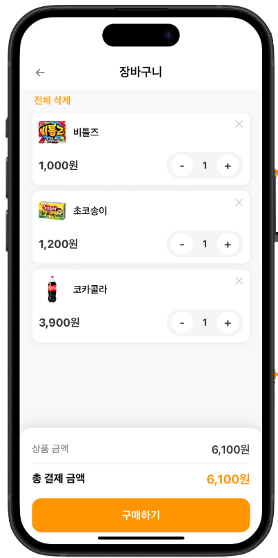

# ONEPIC - AI 기반 영수증 인식 및 장바구니 관리 시스템

## 프로젝트 개요

ONEPIC은 AI 기술을 활용한 영수증 및 상품 인식 기반의 스마트 장바구니 관리 시스템입니다. 사용자가 영수증을 촬영하면 OCR과 객체 인식 모델을 통해 상품 정보를 자동으로 인식하고, 이를 바탕으로 장바구니를 구성하여 편리한 쇼핑 경험을 제공합니다.

<p align="center">


</p>

## 전체 아키텍처 구조

```
┌─────────────────┐    ┌─────────────────┐    ┌─────────────────┐
│  React Native   │    │     FastAPI     │    │      MySQL      │
│   (Frontend)    │◄──►│   (Backend)     │◄──►│   (Database)    │
│                 │    │                 │    │                 │
│ • 영수증 촬영   │    │ • AI 모델 추론   │    │ • 사용자 데이터 │
│ • 상품 스캔     │    │ • OCR 처리       │    │ • 상품 정보     │  
│ • 장바구니 관리 │    │ • 상품 인식      │    │ • 장바구니      │
│ • 결제 처리     │    │ • API 서비스     │    │ • 영수증 기록   │
└─────────────────┘    └─────────────────┘    └─────────────────┘
                              │
                       ┌─────────────┐
                       │ AI Models   │
                       │ • YOLOv8    │
                       │ • MobileNet │
                       │ • PaddleOCR │
                       └─────────────┘
```

## 기술 스택

### Backend
- **Framework**: FastAPI 
- **ORM**: SQLAlchemy
- **Database**: MySQL (PyMySQL 드라이버)
- **Authentication**: JWT (python-jose)
- **AI/ML**: PyTorch, Ultralytics (YOLOv8), PaddleOCR
- **Validation**: Pydantic

### Frontend  
- **Framework**: React Native
- **State Management**: React Hooks
- **Navigation**: React Navigation

### Database
- **RDBMS**: MySQL
- **Connection**: Connection Pooling (pool_pre_ping, pool_recycle)
- **Timezone**: KST (UTC+9) 기준 시간 관리

## 담당 역할 - 데이터베이스

데이터베이스 아키텍처 설계 및 백엔드 데이터 계층 구현을 담당하였습니다.

### 주요 담당 영역
- 관계형 데이터베이스 스키마 설계
- SQLAlchemy ORM 모델 정의  
- 데이터베이스 연결 및 세션 관리
- Pydantic 스키마 정의
- 의존성 주입 시스템 구축

## 핵심 구현 내용

### 1. 데이터베이스 연결 관리
[database.py](backend/app/database/database.py)에서 MySQL 연결 풀링과 세션 관리를 구현했습니다.
```python
engine = create_engine(
    DATABASE_URL,
    pool_pre_ping=True,   # 연결 끊김 감지 후 재연결
    pool_recycle=1800,    # 서버 idle timeout 대비
)
```

### 2. 데이터 모델 설계 (11개 테이블)
관계형 데이터베이스 설계를 통해 정규화된 스키마를 구축했습니다.
- **핵심 엔터티**: [User](backend/app/models/user.py), [Product](backend/app/models/product.py), [Cart](backend/app/models/cart.py), [Receipt](backend/app/models/receipt.py)
- **관계 테이블**: [CartItem](backend/app/models/cart_item.py), [ReceiptItem](backend/app/models/receipt_items.py)
- **분류 테이블**: [Category](backend/app/models/category.py), [Brand](backend/app/models/brand.py)
- **확장 테이블**: ProductAttribute, RecognitionLog, AiProductMapping

### 3. 관계형 모델 매핑
SQLAlchemy를 활용하여 객체-관계 매핑을 구현했습니다.
```python
# 1:1 관계 (User ↔ Cart)
cart = relationship("Cart", back_populates="user", uselist=False, cascade="all, delete-orphan")

# 1:N 관계 (User ↔ Receipt)  
receipts = relationship("Receipt", back_populates="user", cascade="all, delete-orphan")

# N:M 관계 (Cart ↔ Product via CartItem)
items = relationship("CartItem", back_populates="cart", cascade="all, delete-orphan")
```

### 4. 시간대 처리
한국 표준시(KST) 기준으로 일관된 시간 관리를 위한 유틸리티 함수를 구현했습니다.
```python
def kst_now():
    return datetime.utcnow() + timedelta(hours=9)
    
created_at = Column(DateTime, nullable=False, default=kst_now)
```

### 5. 의존성 주입 시스템
[dependencies.py](backend/app/core/dependencies.py)에서 FastAPI의 Depends를 활용한 의존성 주입을 구현했습니다.
```python
def get_db():
    db = SessionLocal()
    try:
        yield db
    finally:
        db.close()
```

## 코드 리뷰 요약

### 구조적 개선점
- **순환 Import 문제**: [product.py](backend/app/models/product.py#L5-L6)에서 Brand, Category import 시 순환 참조 발생
- **중복 함수**: `kst_now()` 함수가 [user.py](backend/app/models/user.py#L9-L11), [cart.py](backend/app/models/cart.py#L8-L10), [receipt.py](backend/app/models/receipt.py#L9-L11)에 중복 정의
- **파일 구조**: 관련 기능별 패키지 분리 필요

### 가독성 개선점  
- **네이밍 일관성**: 테이블명 단수/복수 혼재 (`user` vs `receipts`)
- **주석 부족**: 비즈니스 로직에 대한 설명 부족
- **타입 힌트**: Optional 타입 표기 일관성 부족

### 책임 분리 문제
- **라우터 비대화**: [auth.py](backend/app/routers/auth.py#L15-L40)에 데이터베이스 로직과 비즈니스 로직 혼재
- **서비스 계층**: 데이터 접근과 비즈니스 로직 분리 미흡

### 예외 처리 문제
- **데이터베이스 에러**: SQLAlchemy 예외에 대한 구체적 처리 부족  
- **제약 조건**: 외래키 제약 위반 시 사용자 친화적 메시지 부족
- **트랜잭션**: 원자적 연산에 대한 롤백 처리 미흡

## 리팩토링 내용

### 개선 전 구조
```
app/models/
├── user.py (kst_now 함수 중복)
├── cart.py (kst_now 함수 중복)  
├── receipt.py (kst_now 함수 중복)
└── product.py (순환 import)

app/routers/
└── auth.py (DB 로직 + 비즈니스 로직 혼재)
```

### 개선 후 구조  
```
app/
├── core/
│   ├── utils.py (kst_now 통합)
│   └── exceptions.py (커스텀 예외)
├── models/
│   ├── __init__.py (import 순서 관리)
│   └── base.py (공통 필드)
├── services/
│   ├── auth_service.py (비즈니스 로직 분리)
│   └── user_service.py (데이터 접근 로직)
└── repositories/
    └── user_repository.py (DB 접근 계층)
```

### 주요 개선 사항

1. **공통 유틸리티 분리**
```python
# app/core/utils.py
def kst_now():
    return datetime.utcnow() + timedelta(hours=9)
```

2. **순환 Import 해결**
```python  
# app/models/__init__.py에서 import 순서 관리
from .brand import Brand
from .category import Category  
from .product import Product
```

3. **계층 분리**
```python
# Repository Layer (데이터 접근)
class UserRepository:
    def create_user(self, db: Session, user_data: dict):
        # DB 접근 로직만
        
# Service Layer (비즈니스 로직)  
class AuthService:
    def register_user(self, user_data: UserCreate):
        # 비즈니스 로직 + Repository 호출
```

## 트러블슈팅

### 1. MySQL 연결 끊김 문제
**문제**: 장시간 idle 상태에서 connection timeout 발생  
**해결**: `pool_pre_ping=True`, `pool_recycle=1800` 설정으로 연결 상태 관리

### 2. 시간대 처리 이슈  
**문제**: UTC와 KST 간 시간 불일치로 클라이언트-서버 간 시간 동기화 문제  
**해결**: 모든 datetime 필드에서 `kst_now()` 함수 통일 사용

### 3. 외래키 제약 조건 에러
**문제**: 존재하지 않는 product_id로 CartItem 생성 시 500 에러  
**해결**: 사전 검증 로직 추가 및 명확한 에러 메시지 제공

## 배운 점

1. **ORM 관계 설계의 중요성**: 적절한 cascade 옵션과 lazy loading 설정이 성능에 큰 영향
2. **의존성 주입 패턴**: FastAPI의 Depends를 활용한 깔끔한 의존성 관리
3. **계층 분리**: Repository-Service-Controller 패턴의 필요성과 장점
4. **데이터 검증**: Pydantic과 SQLAlchemy 간 역할 분담의 중요성

## 향후 개선 방향

### 1. 성능 최적화
- 인덱스 최적화 (복합 인덱스, 부분 인덱스)
- 쿼리 성능 분석 및 N+1 문제 해결
- 커넥션 풀 크기 조정

### 2. 확장성 개선
- 읽기 전용 복제본 분리
- 캐싱 레이어 추가 (Redis)
- 데이터베이스 샤딩 고려

### 3. 운영 관리
- 마이그레이션 도구 도입 (Alembic)
- 백업/복구 자동화
- 모니터링 및 알람 시스템

## 실행 방법

### 1. 환경 설정
```bash
# 의존성 설치
pip install -r backend/requirements.txt

# 환경변수 설정
cp .env.example .env
# DB 연결 정보 수정
```

### 2. 데이터베이스 초기화  
```bash
# MySQL 데이터베이스 생성
CREATE DATABASE onepic CHARACTER SET utf8mb4 COLLATE utf8mb4_unicode_ci;
```

### 3. 서버 실행
```bash  
# Backend 서버 시작
uvicorn app.main:app --app-dir backend --host 0.0.0.0 --port 8000

# 또는 VS Code Task 사용
Ctrl+Shift+P > Tasks: Run Task > "Run backend (uvicorn)"
```
